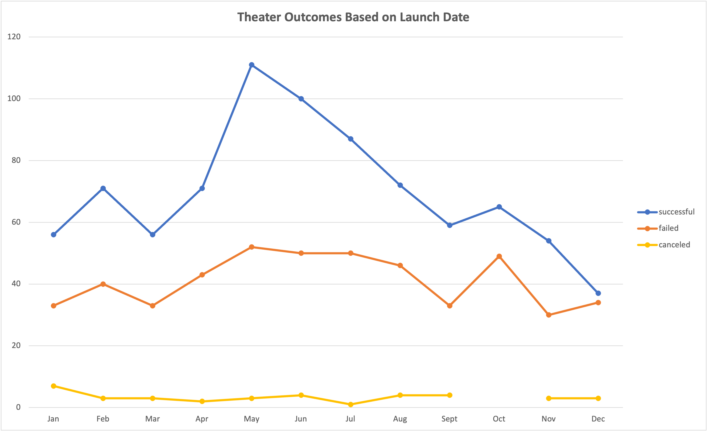
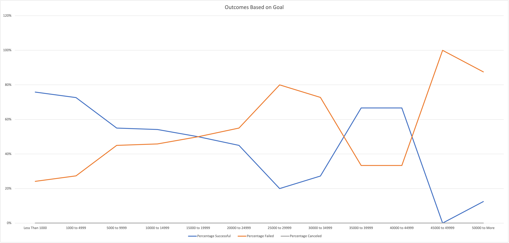

# An Analysis of Kickstarter Campaigns

## Performing data analysis on Croudfunding Projects to uncover trends.

## Overview of Project

### Louise wants to start a crowdfunding campaign to help fund her play "FEVER". She estimated a Budget of over $10,000 and is hestant to jump into her first fundraising campaign. She is looking for help to Organize, Sort and analyze crowdfunding data to determine specific factors that make projects campaign successful. We will be performing data analysis on crowd funding projects to uncover any hidden trends and provide insights and set her campaign to mirror other successful campaings in same category.

## Purpose of Project

### Purpose of this Project is to find out how different campaigns fared untilizing available kickstarter data.

# An Analysis of Campaigns Based on Launch dates

## Performing data analysis on Croudfunding Projects to uncover trends based on Launch dates and funding goals.

## Overview of Project

### Louise wants to start a crowdfunding campaign to help fund her play "FEVER". She estimated a Budget of over $10,000 and is hestant to jump into her first fundraising campaign. She is looking for help to Organize, Sort and analyze crowdfunding data to determine specific factors that make projects campaign successful. We will be performing data analysis on crowd funding projects to uncover any hidden trends and provide insights and set her campaign to mirror other successful campaings in same category.

## Purpose of Project

### Purpose of this Project is to find out how different campaigns fared in relation to their launch date and their funding goals untilizing available kickstarter data.

### Analysis of Outcomes Based on Launch Date

*   From this analysis we found that for parent category "Theater" the month of May launched most successful Kickstarter campaigns.

*   However, January, March, September and November and december all had roughly the same number of failed campaigns launched. 

*   The Theater campaign followed an overall trend: There is a spike of successful campaigns that began in May, but tapered off by the end of the year. 

*   The findings can be determined by examining the points along the trend lines of the given chart. 

### Analysis of Outcomes Based on Goals

*   From Outcomes based on Goals analysis it can be determined that percentage Failed Kickstarter campaigns was lower for lower fundraising goals.

*   The line chart also dictates that the campaigns with lower fudraising goals had high success rate. 

*   In result we can conclude that the higher the fund raising goals the lower the success rate of a campaign.  

### Challenges and Difficulties Encountered

## Results

- What are two conclusions you can draw about the Outcomes based on Launch Date?

- From this analysis we found that for parent category "Theater" the month of May launched most successful Kickstarter campaigns.

- However, January, March, September and November and december all had roughly the same number of failed campaigns launched. 

- The Theater campaign followed an overall trend: There is a spike of successful campaigns that began in May, but tapered off by the end of the year. 

- What can you conclude about the Outcomes based on Goals?

- Based on Outcomes on goals we can conclude that the higher the fund raising goals the lower the success rate of a campaign.  

- What are some limitations of this dataset?

- What are some other possible tables and/or graphs that we could create?
